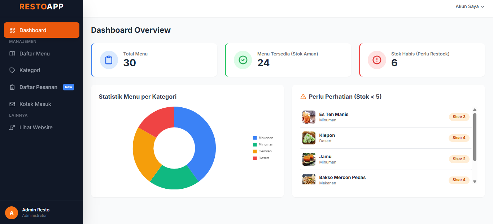
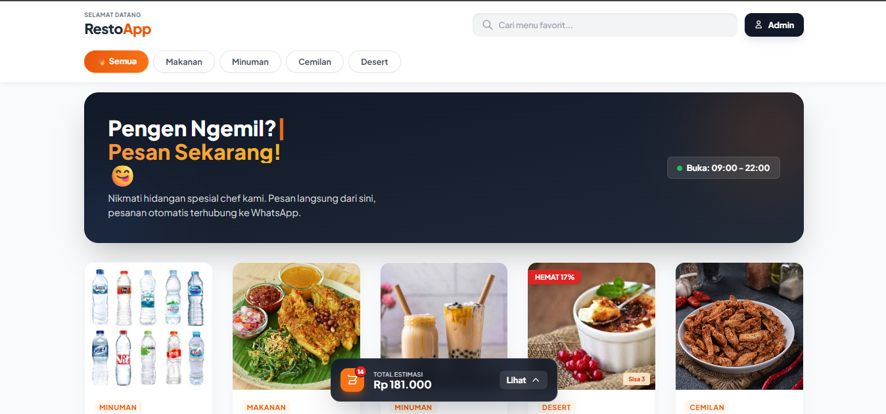

<h1>🍽️ <span style="color:#1e3a8a;">Resto</span><span style="color:#f97316;">App</span> — Digital Menu & WhatsApp Order System</h1>


> A modern web-based digital menu and ordering system powered by Laravel.


RestoApp adalah aplikasi **menu digital berbasis web** yang modern, responsif, dan mudah digunakan.  
Aplikasi ini memungkinkan pelanggan melihat menu, mencari makanan, menambahkan ke keranjang, lalu melakukan pemesanan langsung melalui **WhatsApp tanpa login**.

Dilengkapi dengan **Panel Admin lengkap** untuk mengelola menu, stok, promo, feedback pelanggan, serta QR Code otomatis.

---

## ✨ Fitur Utama

### 📱 Sisi Pelanggan (Public)

- 🎨 **Tampilan Modern & Responsif**  
  Desain Glassmorphism menggunakan Tailwind CSS, optimal di HP & desktop.

- 🛒 **Keranjang Belanja (Alpine.js)**  
  Tambah & hapus menu tanpa reload halaman (state ringan & cepat).

- 🚀 **Checkout via WhatsApp**  
  Pesanan otomatis diformat rapi dan dikirim ke nomor WhatsApp admin.

- 🏷️ **Harga Coret & Promo**  
  Menampilkan diskon dengan tampilan visual menarik.

- 🔍 **Pencarian & Filter Menu**  
  Cari berdasarkan nama atau kategori dengan cepat.

- 💬 **Kritik & Saran**  
  Form feedback pelanggan terintegrasi langsung ke dashboard admin.

- ⌨️ **Typewriter Effect**  
  Animasi teks interaktif pada banner halaman utama.

---

### 🛠️ Sisi Admin (Dashboard)

- 📊 **Dashboard Analitik**
  - Grafik jumlah menu per kategori (Chart.js)
  - Indikator stok menipis

- 🧾 **Manajemen Menu Lengkap**
  - CRUD Menu
  - Upload foto
  - Atur stok
  - Atur harga promo

- 📦 **Manajemen Stok**
  - Indikator warna:
    - 🟢 Aman  
    - 🟠 Hampir habis  
    - 🔴 Habis  

- 📩 **Inbox Feedback**
  - Membaca & mengelola kritik dan saran pelanggan

- 🔳 **QR Code Generator**
  - Otomatis membuat QR unik untuk setiap menu

---

## 💻 Teknologi yang Digunakan

| Teknologi | Deskripsi |
|---------|-----------|
| Framework | Laravel 12 |
| Bahasa | PHP 8.2+ |
| Styling | Tailwind CSS (CDN) |
| Interaksi | Alpine.js |
| Database | MySQL |
| Chart | Chart.js |
| Icon | Heroicons / SVG |

---

## ⚙️ Cara Instalasi (Localhost)

Ikuti langkah berikut untuk menjalankan project secara lokal:

### 1️⃣ Clone Repository
```bash
git clone https://github.com/username-kamu/resto-app.git
cd resto-app.
```

### 2️⃣ Install Dependency PHP
```bash
composer install
```

### 3️⃣ Setup Environment
Salin file .env.example menjadi .env:
```bash
cp .env.example .env
```
Lalu sesuaikan Konfigurasi Database:
```bash
DB_DATABASE=nama_database_kamu
DB_USERNAME=root
DB_PASSWORD=
```

### 4️⃣ Generate Key & Migrasi Database
```bash
php artisan key:generate
php artisan migrate
```
  
### 5️⃣ Storage Link 
Agar gambar menu tampil:
```bash
php artisan storage:link
```

### 6️⃣ Jalankan Server
```bash
php artisan serve 
```

### 🔐 Akun Demo (Seeder)
Login Admin:
```bash
http://localhost:8000/login
```
Email: admin@resto.com

Passw: Password

## 📸 Screenshots

### Halaman Admin


### Public web



## 📝 Lisensi
Project ini menggunakan lisensi MIT.

Dibuat dengan sepenuh ❤️ dan secangkir ☕ oleh [Dipa]
Semoga dapat nilai A hehe.


